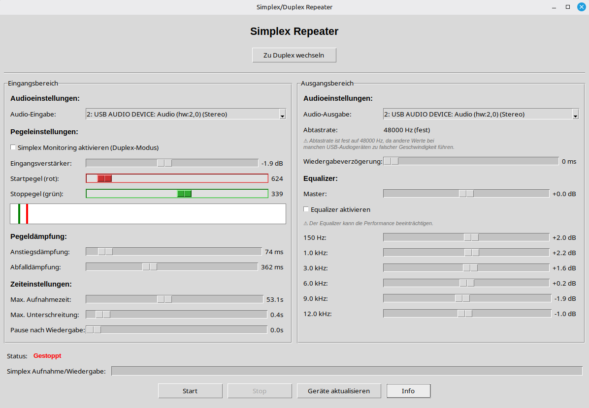

# Simplex/Duplex Repeater

Ein flexibler Audio-Repeater mit grafischer Benutzeroberfläche, der Audio aufnimmt wenn ein Schwellwert überschritten wird und es danach sofort wieder abspielt. Unterstützt sowohl Simplex- (abwechselnd) als auch Duplex-Betrieb (gleichzeitig).



## Schnellstart (auch ohne Programmiererfahrung)

Für den Start wird nur ein Doppelklick benötigt - die Starter-Skripte kümmern sich automatisch um Python, die virtuelle Umgebung und alle Abhängigkeiten.

### Windows
1. Doppelklick auf **`start_simplex_repeater.bat`**
2. Falls Python noch nicht installiert ist, bietet das Skript an, es automatisch herunterzuladen und zu installieren
3. Beim ersten Start werden alle benötigten Pakete installiert - das kann etwas dauern
4. Danach öffnet sich automatisch das Programmfenster

### Linux
1. Doppelklick auf **`start_simplex_repeater.sh`** und "Im Terminal ausführen" wählen
   (falls der Dateimanager das nicht anbietet, ein Terminal im Programmordner öffnen und `./start_simplex_repeater.sh` eingeben)
2. Falls Systempakete wie Tkinter oder PortAudio fehlen, schlägt das Skript den passenden Installationsbefehl vor und fragt, ob es sie automatisch installieren soll (Administratorpasswort erforderlich)
3. Danach öffnet sich automatisch das Programmfenster

Sollte eines der Skripte nicht funktionieren, hilft der Abschnitt [Fehlerbehebung](#fehlerbehebung) weiter, oder Sie folgen der [manuellen Installation](#manuelle-installation).

## Funktionen

### Allgemeine Funktionen
- **Einstellbarer Eingangspegel**: Schwellwert für die Aktivierung der Aufnahme (roter Regler/roter Balken)
- **Einstellbarer Abbruchpegel**: Pegel zum automatischen Stoppen der Aufnahme (grüner Regler/grüner Balken)
- **Schwellwerte direkt in der Pegelanzeige verschiebbar**: Die rote und grüne Linie lassen sich statt über den Schieberegler auch direkt mit der Maus in der Pegelanzeige ziehen
- **Pegeldämpfung**: Attack/Release-Parameter für weichere Pegelübergänge
- **Einstellbare Aufnahmezeit**: 1-120 Sekunden Aufnahmedauer
- **Auswählbare Audio-Quellen**: Wahl des Eingabe- und Ausgabegeräts, unterstützt Mono- und Stereo-Geräte
- **Geräteliste aktualisieren**: Neu angeschlossene Audio-Geräte (z.B. USB-Soundkarten) können ohne Neustart des Programms erkannt werden
- **Echtzeit-Pegelanzeige**: Visualisierung des aktuellen Audiopegels mit Schwellwert-Linien
- **Persistente Konfiguration**: Alle Einstellungen werden automatisch gespeichert, die Geräteauswahl bleibt auch bei geänderten Geräte-Indizes erhalten
- **Kein Speichern von Audio**: Audio wird nur im Speicher gehalten

### Equalizer (Ausgangsbereich)
- **6-Band-Equalizer**: Frequenzbänder bei 150Hz, 1kHz, 3kHz, 6kHz, 9kHz, 12kHz
- **Verstärkungsbereich**: -30 dB bis +30 dB pro Band
- **Echtzeit-Verarbeitung**: Equalizer wird während der Wiedergabe angewendet
- **Butterworth-Filter**: Hochwertige Bandpass-Filter für saubere Frequenztrennung

### Modi
- **Simplex-Modus**: Klassischer Repeater-Betrieb (abwechselnd aufnehmen und abspielen)
  - Totzeit nach Wiedergabe einstellbar (0-10 Sekunden)
  - Keine Aufnahme während der Wiedergabe
  
- **Duplex-Modus**: Gleichzeitiges Aufnehmen und Abspielen
  - Aufnahme wird nicht durch Wiedergabe unterbrochen
  - Kontinuierliche Wiedergabe aufgenommener Signale
  - Ideal für Echo-Effekte oder Live-Monitoring

## Manuelle Installation

Für erfahrene Nutzer, oder falls die Starter-Skripte aus dem [Schnellstart](#schnellstart-auch-ohne-programmiererfahrung) nicht funktionieren:

1. Python 3.8 oder höher muss installiert sein (siehe [Fehlerbehebung](#fehlerbehebung), falls nicht)

2. Unter Linux werden zusätzlich zwei Systempakete benötigt (Tkinter für die Oberfläche, PortAudio für die Audio-Ein-/Ausgabe):
```bash
# Ubuntu/Debian
sudo apt install python3-tk portaudio19-dev

# Fedora
sudo dnf install python3-tkinter portaudio-devel

# Arch Linux
sudo pacman -S tk portaudio
```

3. (Optional, empfohlen) Virtuelle Umgebung anlegen und aktivieren:
```bash
python3 -m venv venv
source venv/bin/activate      # Linux/macOS
venv\Scripts\activate.bat     # Windows
```

4. Python-Abhängigkeiten installieren:
```bash
pip install -r requirements.txt
```

## Verwendung

Starten Sie das Programm:
```bash
python simplex_repeater.py
```

Oder einfach eines der Starter-Skripte aus dem [Schnellstart](#schnellstart-auch-ohne-programmiererfahrung) verwenden.

### Bedienung

#### Eingangsbereich (links)
1. **Startpegel einstellen**: Schwellwert zum Auslösen der Aufnahme (0-10000)
2. **Stoppegel einstellen**: Schwellwert zum automatischen Beenden der Aufnahme (0-Startpegel)
3. **Pegeldämpfung**: Attack/Release für weiche Pegelübergänge (0-1000 ms)
4. **Zeiteinstellungen**: Max. Aufnahmezeit, Unterschreitungszeit, Totzeit
5. **Audio-Eingabe**: Auswahl des Aufnahmegeräts

#### Ausgangsbereich (rechts)
1. **Equalizer**: 6 Frequenzbänder mit jeweils -30 bis +30 dB Verstärkung
   - 150 Hz: Tiefe Bässe
   - 1 kHz: Untere Mitten
   - 3 kHz: Obere Mitten
   - 6 kHz: Präsenz
   - 9 kHz: Höhen
   - 12 kHz: Obere Höhen
2. **Audio-Ausgabe**: Auswahl des Wiedergabegeräts
3. **Wiedergabeverstärkung**: Globale Verstärkung -20 bis +20 dB

#### Geräte aktualisieren
- Der Button **"Geräte aktualisieren"** unterhalb von Start/Stop lädt die Liste der Audio-Geräte neu
- Notwendig, wenn eine USB-Soundkarte erst nach dem Programmstart angeschlossen wurde, da PortAudio Geräte nur einmal beim Start erfasst
- Nur im gestoppten Zustand verfügbar

#### Modus-Umschaltung
- **Zu Duplex wechseln**: Wechselt zum gleichzeitigen Aufnahme-/Wiedergabebetrieb
- **Zu Simplex wechseln**: Wechselt zum abwechselnden Betrieb
- Modus kann nur im gestoppten Zustand gewechselt werden

## Technische Details

- **Audio-Format**: 16-bit PCM
- **Samplerate**: einstellbar zwischen 8000 Hz und 44100 Hz
- **Kanäle**: Mono oder Stereo, abhängig vom gewählten Ein-/Ausgabegerät (automatische Kanalanpassung)
- **Puffergröße**: 1024 Frames
- **Equalizer**: 4. Ordnung Butterworth Bandpass/Lowpass/Highpass Filter
- **Threading**: Separate Threads für GUI und Audio-Verarbeitung
  - Simplex: Ein Audio-Thread mit sequenzieller Aufnahme/Wiedergabe
  - Duplex: Zwei parallele Threads für kontinuierliche Aufnahme und Wiedergabe

## Hinweise

### Simplex-Modus
- Während der Wiedergabe wird nicht aufgenommen
- Totzeit nach Wiedergabe verhindert sofortiges erneutes Triggern
- Klassischer Repeater-Betrieb für Durchsagen

### Duplex-Modus
- Aufnahme und Wiedergabe laufen gleichzeitig
- Keine Totzeit, kontinuierlicher Betrieb
- **Wichtig**: Elektrische Entkopplung zwischen Lautsprecher und Mikrofon erforderlich, um Rückkopplungsschleifen zu vermeiden

### Equalizer
- Wird nur auf die Wiedergabe angewendet, nicht auf die Aufnahme
- Funktioniert sowohl im Simplex- als auch im Duplex-Modus
- Bei 0 dB (Standard) ist keine Filterung aktiv (optimale Performance)

## Fehlerbehebung

#### "Python wurde nicht gefunden"
- Windows: Python von [python.org/downloads](https://www.python.org/downloads/) installieren und dabei **"Add Python to PATH"** aktivieren, oder im Starter-Skript die automatische Installation bestätigen.
- Linux: `sudo apt install python3 python3-venv python3-pip` (bzw. `dnf`/`pacman`, siehe [Manuelle Installation](#manuelle-installation)).

#### "No module named 'tkinter'" oder das Fenster öffnet sich gar nicht
- Tkinter ist unter Linux ein separates Systempaket und wird nicht über `pip` installiert: `sudo apt install python3-tk` (bzw. `python3-tkinter`/`tk` bei Fedora/Arch).

#### Installation von PyAudio schlägt fehl
- Meist fehlen die PortAudio-Entwicklungsdateien. Installieren Sie `portaudio19-dev` (Ubuntu/Debian), `portaudio-devel` (Fedora) oder `portaudio` (Arch) und führen Sie `pip install -r requirements.txt` erneut aus.
- Unter Windows: `pip install pipwin` und danach `pipwin install pyaudio`.

#### Das gewünschte Audiogerät wird in den Dropdowns nicht angezeigt
- Klicken Sie auf **"Geräte aktualisieren"** (unterhalb von Start/Stop) - PortAudio erfasst neu angeschlossene Geräte (z.B. USB-Soundkarten) nur beim (Neu-)Initialisieren, nicht automatisch während das Programm läuft.
- Prüfen Sie mit `python debug_devices.py`, ob das Betriebssystem das Gerät überhaupt erkennt.

#### Das Programm findet ein zuvor ausgewähltes Gerät nicht mehr
- Das kann passieren, wenn sich der Geräte-Index seit dem letzten Start geändert hat (z.B. weil ein anderes USB-Gerät an-/abgesteckt wurde). Wählen Sie das Gerät einfach erneut in der Dropdown-Liste aus - die Auswahl wird gespeichert.

#### Kein Ton/Rückkopplung
- Siehe [Bekannte Einschränkungen](#bekannte-einschränkungen) unten.

## Bekannte Einschränkungen

- **Rückkopplung im Duplex-Modus**: Ohne elektrische Entkopplung zwischen Ausgang und Eingang entsteht eine Aufnahme-Wiedergabe-Schleife. Dies lässt sich nicht durch Software vermeiden.
- **Equalizer-Latenz**: Der Equalizer fügt eine minimale Verarbeitungslatenz hinzu
- **CPU-Last**: Der Duplex-Modus mit aktivem Equalizer benötigt mehr CPU-Ressourcen
- **Geräteerkennung**: Neu angeschlossene Geräte werden erst nach einem Klick auf "Geräte aktualisieren" erkannt, da PortAudio Geräte nur beim (Neu-)Initialisieren erfasst

## Lizenz

Siehe LICENSE Datei.
